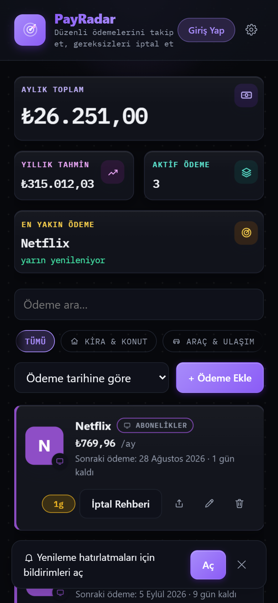
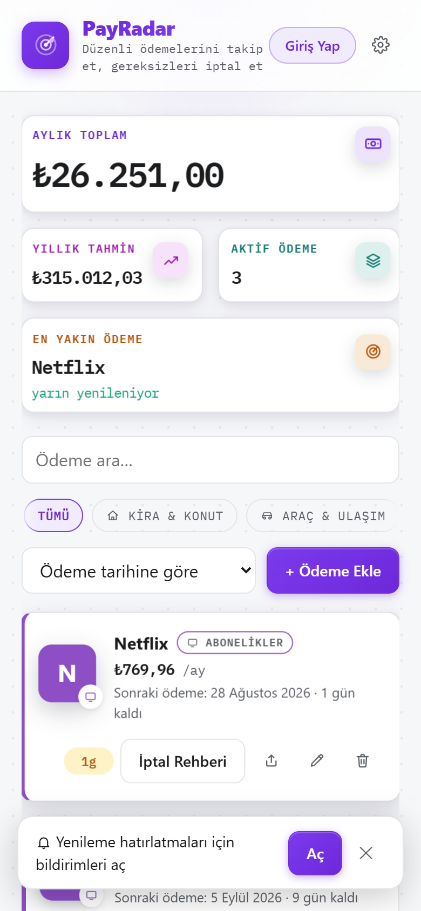
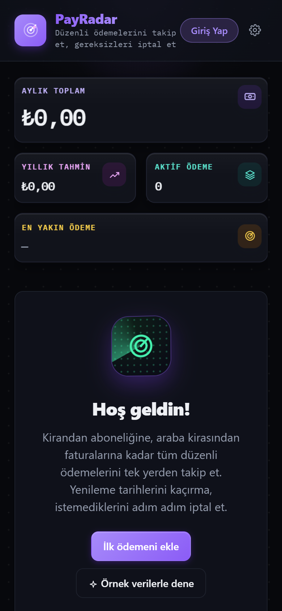

<div align="center">

# 📡 PayRadar

**Tüm düzenli ödemelerini tek, gizli bir yerde takip et.**
_Track every recurring payment — rent, bills, subscriptions — in one private place._

[](LICENSE)
[](https://payradar-bkp.pages.dev)
[](#-languages--diller)
[](#️-tech)

### **[▶ Uygulamayı aç / Open the app](https://payradar-bkp.pages.dev)**

</div>

<div align="center">
  
  
  
</div>

---

## 🇹🇷 Nedir? · 🇬🇧 What is it?

**PayRadar**, kira, fatura, abonelik ve taksitler gibi **düzenli ödemelerini** tek yerden takip etmeni sağlayan, ücretsiz ve açık kaynak bir uygulamadır. Her ödemenin ne zaman yenileneceğini önceden görür, gereksizleri fark edip iptal edersin. Verilerin **cihazında** kalır — istemezsen hiçbir sunucuya gitmez.

_PayRadar is a free, open-source tracker for your recurring payments — rent, bills, subscriptions, installments. See what renews next, catch what you no longer need, and cancel it. Your data stays **on your device** unless you choose to sync._

## ✨ Özellikler · Features

- 📊 **Anlık özet** — aylık & yıllık toplam, aktif ödeme sayısı, en yakın yenileme
- 🗂️ **11 kategori** — konut, ulaşım, fatura, abonelik, eğitim, sağlık, sigorta, banka kredisi, çek/senet, oyun, diğer
- 💱 **160+ para birimi, canlı kur motoru** — ödemeni herhangi bir birimde gir; Ayarlar'dan seçtiğin **tek gösterim birimine** güncel kurla otomatik çevrilir. 48.000 ₺'lik portföyün, birimi $'a çevirince güncel kurla ≈ $1.000 görünür — offline'da bile çalışır
- 🔔 **Akıllı hatırlatmalar** — yenilemeden 1–7 gün önce tarayıcı bildirimi; aynı gün birkaç ödeme varsa gruplu özet
- 🚫 **İptal rehberleri** — Netflix, Spotify, Game Pass ve onlarca servis için adım adım iptal + doğrudan bağlantı
- 🔐 **Gizlilik önce** — veriler cihazda AES-256-GCM ile şifreli; opsiyonel PIN kilidi; istersen şifreli bulut senkronu (giriş yalnızca Google hesabıyla)
- 🌗 **Koyu / açık tema**, **kulüp temaları** (Galatasaray, Fenerbahçe, Beşiktaş, Trabzonspor) ve **radar** kimliği — çizgi ikonlar, canlı sinyal rengi
- 📱 **PWA** — telefona/masaüstüne kurulur, tamamen çevrimdışı çalışır

## 🌍 Languages · Diller

Arayüz beş dilde, tarayıcından otomatik seçilir:

🇹🇷 Türkçe · 🇬🇧 English · 🇲🇾 Bahasa Melayu · 🇪🇸 Español · 🇸🇦 العربية _(sağdan-sola tam destek)_

## 🔒 Gizlilik & Güvenlik · Privacy & Security

| Katman | Detay |
|---|---|
| Yerel öncelikli | Tüm veriler tarayıcının kendi belleğinde; sunucu zorunlu değil |
| AES-256-GCM | Kasa verisi cihazda şifreli saklanır (WebCrypto) |
| PBKDF2-SHA256 | 150.000 tur anahtar türetme; anahtar **yalnızca bellekte** |
| Opsiyonel bulut | Açarsan veri cihazında **şifrelenir**, sunucuya yalnızca şifreli blok gider. Anahtar Google hesabının kimliğinden türetilir ve ayrıca saklanmaz — her cihaz kendiliğinden açılır, kurtarma anahtarı gerekmez. Dürüst not: bu, uçtan uca şifreleme **değildir**; anahtar hesap kimliğinden türediği için veritabanına tam erişimi olan bir taraf içeriği çözebilir. Koruduğu şey aktarım, yedek/log sızıntıları ve satır dışı erişimlerdir |
| Reklam & takip yok | Analytics yok, üçüncü taraf yok |

## 🛠️ Tech

React 19 · TypeScript · Vite · PWA (Service Worker + Web App Manifest) · WebCrypto · Supabase (opsiyonel senkron) · Cloudflare Pages · Android **TWA**

## 🚀 Yerel çalıştırma · Run locally

```bash
npm install
npm run dev      # geliştirme sunucusu
npm run build    # üretim derlemesi (dist/)
npm run preview  # derlemeyi önizle
```

## 📄 Lisans · License

[MIT](LICENSE) © 2026 Erol Tasci — özgürce kullan, çatalla, katkı yap.

---

<div align="center">

<a href="https://gitlab.com/Voyagerroc/payradar">
  <br>
  <sub><b>Hosted on GitLab</b> · gitlab.com/Voyagerroc/payradar</sub>
</a>

</div>
